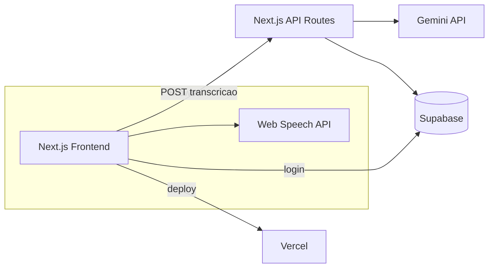

# Technical Context — Grace Hopper

> Fonte de verdade para Engenharia. Atualizado Jun/2026. **Stack ativa = MVP gratuito** — alinhado a `Cursor_docs/GRACE_HOPPER_CURSOR_MVP_GUIDE.md` e `GRACE_HOPPER_ADR.md` v2.0.

## 1. Stack Tecnológica

### MVP ativo (decisão fechada — Jun/2026)

| Camada | Tecnologia |
|--------|------------|
| **Linguagem** | TypeScript (frontend + API) |
| **Framework** | Next.js 14+ (App Router), Tailwind CSS, shadcn/ui |
| **Backend** | Next.js API Routes na Vercel (**sem FastAPI no MVP**) |
| **Banco de Dados** | Supabase PostgreSQL + Auth (Google OAuth) + RLS |
| **IA** | Google Gemini API (Google AI Studio — free tier) |
| **Voz (STT)** | Web Speech API no browser (**sem Google Cloud STT no MVP**) |
| **Infraestrutura** | Vercel (deploy único, hobby/free) |
| **Custo alvo** | R$ 0 — evitar serviços que exigem cartão |

### Evolução possível (V2+ — não ativa no MVP)

- **Google Cloud Speech-to-Text** — se precisão de voz for bloqueante
- **FastAPI** (Render/Railway) — se backend Python fizer sentido em escala
- Ver seção "Decisões Futuras" em `GRACE_HOPPER_ADR.md`

## 2. Padrões de Código (Code Standards)

- TypeScript strict mode
- App Router (não Pages Router)
- Arquivos e rotas em convenção Next.js (`app/`)
- Componentes UI via shadcn/ui
- Design system Grace Hopper:
  - Primary: `#F4A642`
  - Background: `#F7F4EE`
  - Neutral: `#1A1A1A`
  - Border: `#ECE6DB`
- Estilo visual: calmo, minimalista, cantos arredondados, muito espaço em branco
- Secrets em `.env.local`; nunca commitar chaves (`.gitignore`)
- Supabase: Row Level Security em tabelas `interviews` e `feedback`

## 3. Arquitetura Lógica (Visão Simplificada)



**Fluxo de dados (entrevista):**
1. Frontend exibe pergunta (gerada via API + Gemini ou cache)
2. Usuário grava voz → Web Speech API transcreve no browser
3. Frontend envia transcrição para API Route `/analyze` (ou similar)
4. API Route chama Gemini com prompt estruturado → JSON de feedback
5. Resultado salvo no Supabase (interviews + feedback)
6. Dashboard lê histórico do Supabase

**Estrutura de pastas alvo** (do guia Cursor):
```
Project Grace Hooper/
├── grace-hopper-web/          ← código Next.js (Lovable export) — AINDA NÃO CRIADO
├── grace_hopper_ai_docs (2)/  ← docs de referência legadas
├── Cursor_docs/               ← guia MVP ativo
├── docs/                      ← contexto Onion (este arquivo)
└── README.md
```

**Estado atual do repositório:** aplicação funcional completa (100% implementada localmente em `grace-hopper-web/`), corrigida e auditada contra acessibilidade, design de foco e segurança (CORS/CSRF).

## 4. Planos de Implementação Ativos

### Plano para MVP Grace Hopper (Iniciado do Zero)

**Checklist de progresso:**

- [x] Inicializar projeto Next.js limpo na pasta `grace-hopper-web`
- [x] Criar arquivo de variáveis de ambiente `.env.local` e configurar `.gitignore`
- [x] Configurar design-system e rotas shell (landing, login, dashboard, interview, feedback)
- [x] Integrar Supabase Auth Google OAuth + RLS + tabelas `interviews`/`feedback`
- [x] Fluxo entrevista: gerar pergunta, Web Speech API, API Route analyze com Gemini
- [x] Telas feedback e dashboard com histórico real do Supabase
- [x] Otimizar performance (CLS, LCP) e corrigir segurança/CSRF e acessibilidade (Focus Rings)
- [ ] Deploy Vercel em produção, README final de portfólio, Miro + LinkedIn demo

**Páginas do MVP (ordem sugerida):**

| # | Página | Prioridade |
|---|--------|------------|
| 1 | Landing | MUST |
| 2 | Login (Google/Supabase) | MUST |
| 3 | Dashboard | MUST |
| 4 | Entrevista (pergunta + voz) | MUST |
| 5 | Feedback (score, strengths, improvements) | MUST |

**Metas de performance:**

| Métrica | Alvo |
|---------|------|
| Resposta IA (feedback) | < 3s |
| Transcrição (browser) | < 500ms percebido |
| Page load | < 2s |
| Uptime | 99.9% (pós-deploy) |

### Cronograma referência (2 semanas — `grace_hopper_product_os.md`)

- **Semana 1:** setup, landing, auth, interview page, Gemini, feedback, dashboard
- **Semana 2:** polish UI, responsividade, deploy, GitHub, portfólio, LinkedIn

### Progresso reportado (README — real)

| Componente | Status | Progresso |
|------------|--------|-----------|
| Frontend | Concluído | 100% |
| Backend | Concluído | 100% |
| AI Integration | Concluído | 100% |
| Documentação | Completa | 100% |
| Launch | Pronto para Deploy | 100% |

> **Nota @docs:** O código da aplicação Next.js local está 100% pronto na pasta `grace-hopper-web/`. O próximo passo do ciclo é a publicação (Deploy) em produção.
