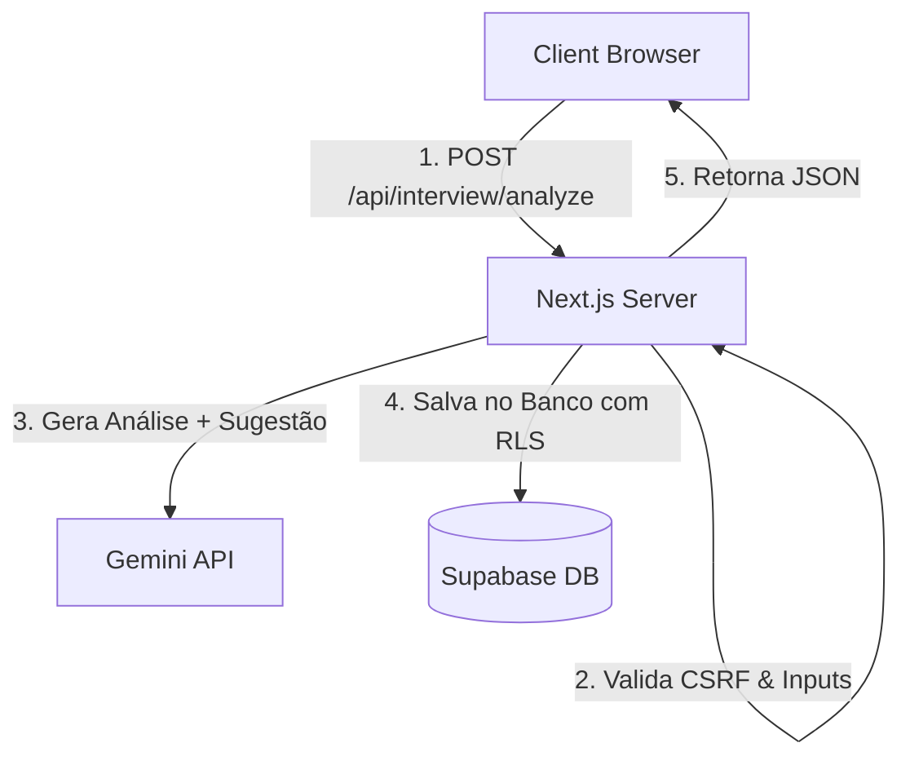

# TDD - Simulador de Entrevistas Grace Hopper (Melhorias de Feedback e Segurança)

| Campo | Valor |
| --- | --- |
| Tech Lead | @Antigravity |
| Equipe | Camila dos Santos |
| Status | Aprovado |
| Criado | 2026-06-11 |
| Última Atualização | 2026-06-11 |

---

## Contexto
O **Projeto Grace Hopper** é uma aplicação web construída em Next.js e Supabase para simulação de entrevistas de emprego por voz. O sistema transcreve a fala do candidato e utiliza a API do Google Gemini para avaliar o desempenho. Este documento cobre o design técnico das melhorias de feedback (sugestão de frases de alto nível) e segurança (proteção contra CSRF e validação de entrada).

---

## Definição do Problema e Motivação
1. **Falta de Feedback Acionável:** Os candidatos recebiam avaliações descritivas de oratória e conhecimento técnico, mas careciam de exemplos concretos de frases profissionais ("Como dizer isso melhor") que poderiam ter usado na resposta.
2. **Riscos de Segurança (CSRF):** Os endpoints de API (`start` e `analyze`) utilizavam autenticação baseada em cookies do Supabase SSR, mas não verificavam a origem da requisição, deixando a aplicação vulnerável a ataques de Cross-Site Request Forgery.
3. **Falta de Validação Estrita de Entrada:** A API aceitava transcrições arbitrárias sem verificação de formato ou limite de tamanho, o que representava riscos de estouro de tokens de IA ou abuso do banco de dados.

---

## Escopo

### ✅ No Escopo
* Lógica de processamento e separação de sugestões de frases profissionais no backend (Lite Mode e Gemini Prompt).
* Renderização premium das sugestões de frases em caixas informativas destacadas no frontend.
* Implementação de validação de origem (`Origin` e `Host` match) contra ataques CSRF nos Route Handlers de POST.
* Validação de formato UUID para identificadores de entrevista e limite de 10.000 caracteres para transcrições.
* Correção de acessibilidade e design de foco visual (`focus-visible:ring-*`) e reticências (`…`) no app.

### ❌ Fora do Escopo
* Implementação de tokens CSRF baseados em criptografia assimétrica (Origin Check é suficiente por ser same-site).

---

## Solução Técnica

### Arquitetura de Fluxo de Dados



### Contrato de API

#### `POST /api/interview/analyze`
* **Request Payload**:
  ```json
  {
    "interviewId": "bed78567-eb57-4a92-aae2-c73a744db6ea",
    "transcript": "Texto da resposta falada..."
  }
  ```
* **Formato do Retorno de Feedback Técnico/Comunicação**:
  ```text
  [Texto de avaliação descritiva...]

  Sugestões de frases:
  - "Frase recomendada 1..."
  - "Frase recomendada 2..."
  ```

---

## Considerações de Segurança
* **CSRF Mitigation:** O servidor compara o cabeçalho `Origin` com o cabeçalho `Host`. Se as origens divergirem, a requisição é negada imediatamente com `403 Forbidden`.
* **Input Sanitization:** Validação estrita por meio de expressão regular regex para UUIDs na API de análise, impedindo ataques de injeção de parâmetros.

---

## Plano de Testes
1. **Teste Manual de CSRF:** Enviar requisição HTTP POST para `/api/interview/start` com cabeçalho `Origin: http://site-malicioso.com` e verificar se o status retornado é `403 Forbidden`.
2. **Teste de Validação de Input:** Enviar payload de transcrição acima de 10.000 caracteres e validar o bloqueio do servidor com erro 400.
3. **Validação Visual (UI):** Testar a navegação por teclado (Tab) e garantir que o anel azul de foco visual aparece corretamente em todos os botões e links.
