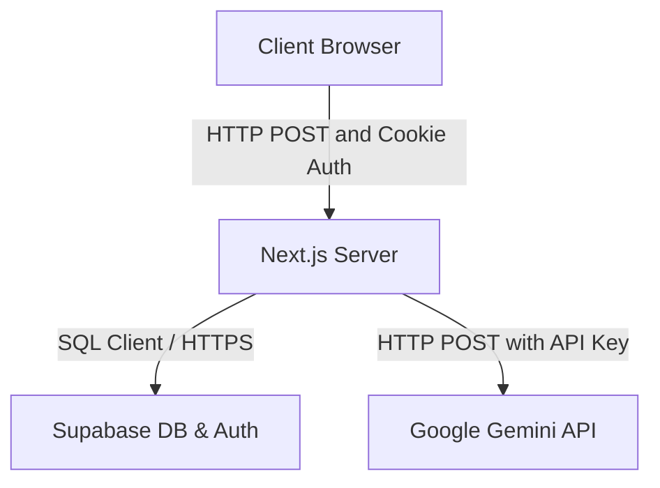

# Threat Model: Grace Hopper Web

Este documento estabelece o modelo de ameaças para a aplicação **Grace Hopper Web**, focando nos fluxos de dados, limites de confiança e riscos de segurança da infraestrutura de simulação de entrevista por voz.

---

## Executive summary
O Grace Hopper Web é um simulador de entrevistas que transcreve voz de usuários em tempo real e avalia sua oratória e respostas técnicas com IA (Gemini). O principal tema de risco está concentrado no tráfego de dados sensíveis (áudio/transcrições de candidatos) trafegando entre o navegador, os Route Handlers do Next.js, as tabelas de banco de dados do Supabase e as APIs externas do Google Gemini. A proteção de sessões baseadas em cookies no cliente e a higienização de inputs no servidor representam os maiores pilares de proteção.

---

## Scope and assumptions
### In-scope paths
* [app/api/interview/start/route.ts](file:///c:/Users/Pulse%20Mais/OneDrive/Project%20Grace%20Hooper/grace-hopper-web/app/api/interview/start/route.ts) - Endpoint de criação de sessões
* [app/api/interview/analyze/route.ts](file:///c:/Users/Pulse%20Mais/OneDrive/Project%20Grace%20Hooper/grace-hopper-web/app/api/interview/analyze/route.ts) - Endpoint de processamento e feedback de áudio/transcrição
* [proxy.ts](file:///c:/Users/Pulse%20Mais/OneDrive/Project%20Grace%20Hooper/grace-hopper-web/proxy.ts) - Regras de roteamento de sessão e proteção de rotas

### Out-of-scope items
* Infraestrutura interna do banco de dados e autenticação gerenciados pelo Supabase Cloud.
* Servidores internos de processamento do Google Gemini.

### Assumptions
* A aplicação é implantada publicamente (ex: Vercel) com HTTPS habilitado.
* Supabase é configurado com políticas de segurança RLS (Row Level Security) ativas em todas as tabelas.
* O cadastro é aberto ao público geral.

### Open questions
* Existe rate-limiting ativo no gateway/borda da hospedagem (ex: Vercel rate-limiting) para prevenir abuso de custos com a API do Gemini?

---

## System model

### Primary components
* **Browser Client:** Interface SPA em React rodando no navegador do usuário.
* **Next.js Route Handlers (Server):** Endpoints serverless que gerenciam a lógica de negócios e chaves de API confidenciais.
* **Supabase Client (SSR/Admin):** Interface de conexão com banco de dados e gerenciamento de autenticação.
* **Gemini API Service:** Modelo de linguagem externo (LLM) que realiza a avaliação das respostas dos candidatos.

### Data flows and trust boundaries
* **User Input (Browser) --> Next.js API Server:** Transcrições de voz e configurações de entrevistas passadas por HTTPS (Boundary 1).
* **Next.js API Server --> Supabase Database:** Gravação e leitura de dados de entrevistas e scores via HTTPS utilizando o cliente Supabase Serverless (Boundary 2).
* **Next.js API Server --> Gemini API:** Envio de transcrições e perguntas para avaliação via requisição HTTP autenticada com API Key secreta (Boundary 3).

### Diagram

---

## Assets and security objectives
| Asset | Why it matters | Security objective (C/I/A) |
|---|---|---|
| **Sessões de Usuário (Cookies)** | Controla acesso a dados de entrevistas e histórico de oratória | Confidencialidade / Integridade |
| **API Key do Gemini** | Token de acesso cobrado por uso; se vazado, causa prejuízo financeiro | Confidencialidade |
| **Histórico de Transcrições** | Dados sensíveis da fala dos candidatos e avaliações | Confidencialidade / Integridade |

---

## Attacker model
### Capabilities
* Atacantes remotos externos na internet pública tentando acessar dados de outros usuários ou abusar de chamadas pagas da API do Gemini.
* Ataques automatizados enviando cargas de dados maliciosas em campos de input de transcrição.

### Non-capabilities
* Ataques de intrusão física no servidor da Vercel ou na nuvem do Supabase/Google.

---

## Entry points and attack surfaces
| Surface | How reached | Trust boundary | Notes | Evidence (repo path / symbol) |
|---|---|---|---|---|
| **POST `/api/interview/start`** | Endpoint público de criação de entrevistas | Boundary 1 | Autenticado por cookie do Supabase | [start/route.ts](file:///c:/Users/Pulse%20Mais/OneDrive/Project%20Grace%20Hooper/grace-hopper-web/app/api/interview/start/route.ts#L6) |
| **POST `/api/interview/analyze`** | Envio de resposta falada e análise com IA | Boundary 1 | Autenticado por cookie do Supabase | [analyze/route.ts](file:///c:/Users/Pulse%20Mais/OneDrive/Project%20Grace%20Hooper/grace-hopper-web/app/api/interview/analyze/route.ts#L7) |

---

## Top abuse paths
1. **Bypass de CORS/CSRF:** Um site externo induz o navegador do usuário logado a disparar requisições POST para `/api/interview/analyze`, poluindo o histórico ou gerando custos abusivos com chaves Gemini.
2. **Estouro de Custo por Injeção:** Carga exagerada de texto no campo `transcript` disparada repetidamente para causar estouro de tokens e custos na API do Gemini.

---

## Threat model table
| Threat ID | Threat source | Prerequisites | Threat action | Impact | Impacted assets | Existing controls (evidence) | Gaps | Recommended mitigations | Detection ideas | Likelihood | Impact severity | Priority |
|---|---|---|---|---|---|---|---|---|---|---|---|---|
| **TM-001** | Externo | Usuário autenticado ativo | Ataque de Cross-Site Request Forgery (CSRF) nos endpoints de mutação | Geração de dados e consumo indevido de cotas de IA | API Gemini / Histórico | Origin check nos endpoints de POST ([start/route.ts](file:///c:/Users/Pulse%20Mais/OneDrive/Project%20Grace%20Hooper/grace-hopper-web/app/api/interview/start/route.ts#L22)) | Nenhum gap crítico ativo após a correção | Manter cookies da sessão como SameSite Lax/Strict | Monitorar taxas de erros 403 incomuns | Média | Alta | Alta |
| **TM-002** | Externo | Acesso à API | Envio de strings gigantes para estourar capacidade de processamento | Negação de serviço ou custos de token abusivos | Infraestrutura Next.js / API Gemini | Validação de tamanho da transcrição e UUID Regex ([analyze/route.ts](file:///c:/Users/Pulse%20Mais/OneDrive/Project%20Grace%20Hooper/grace-hopper-web/app/api/interview/analyze/route.ts#L52)) | Nenhum gap crítico ativo após a correção | Adicionar rate-limiting de borda (Cloudflare ou Vercel) | Logar payloads acima de 5KB | Média | Média | Média |

---

## Criticality calibration
* **Critical:** Vazamento de API Keys confidenciais em logs/builds ou bypass completo de autenticação.
* **High:** Execução de ações sem privilégios (ex: ver ou alterar entrevistas de outros usuários).
* **Medium:** Ataques de força bruta a rotas sem rate limits ou inputs muito longos não sanitizados.
* **Low:** Vazamento de mensagens informativas de erro ou debug.

---

## Focus paths for security review
| Path | Why it matters | Related Threat IDs |
|---|---|---|
| [app/api/interview/analyze/route.ts](file:///c:/Users/Pulse%20Mais/OneDrive/Project%20Grace%20Hooper/grace-hopper-web/app/api/interview/analyze/route.ts) | Componente crítico que se conecta com a API do Gemini e executa gravações no Supabase | TM-001, TM-002 |
| [proxy.ts](file:///c:/Users/Pulse%20Mais/OneDrive/Project%20Grace%20Hooper/grace-hopper-web/proxy.ts) | Lógica de interceptação e redirecionamento de acessos de rotas protegidas | TM-001 |

---

## Notes on use
Este modelo de ameaças deve ser atualizado sempre que novas integrações externas ou métodos adicionais de autenticação forem inseridos.
