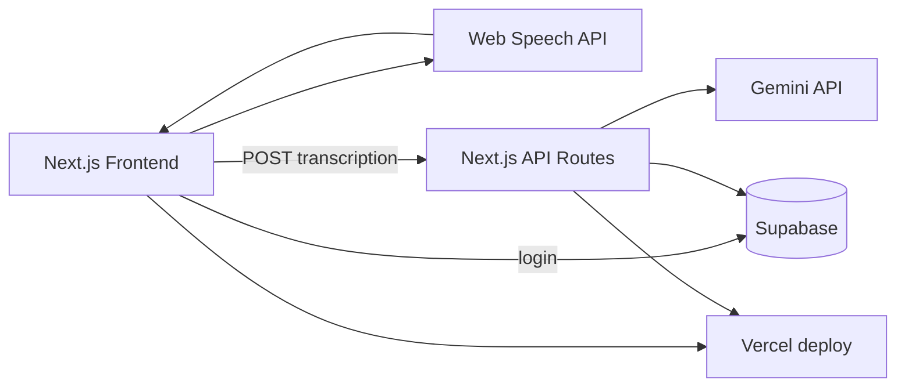

# Technical Architecture

> **MVP (Jun/2026):** Next.js full-stack on Vercel — API Routes + Supabase + Gemini + Web Speech API. No FastAPI, no Google Cloud STT. See `GRACE_HOPPER_ADR.md` v2.0.

## Frontend
- Next.js 14+ (App Router)
- TypeScript
- Tailwind CSS
- shadcn/ui
- Web Speech API (voice capture + transcription in browser)

## Backend (API)
- Next.js API Routes on Vercel (TypeScript)
- Gemini API for question generation and feedback analysis

## Database & Auth
- Supabase PostgreSQL
- Supabase Auth (Google OAuth)
- Row Level Security (RLS)

## AI
- Google Gemini API (Google AI Studio free tier)

## Deployment
- **Vercel** — single deploy (UI + API Routes)
- **Supabase** — managed database and auth

## Cost (MVP)
- **R$ 0** — Vercel hobby + Supabase free + Gemini free tier

## Future (V2+)
- Google Cloud Speech-to-Text or dedicated Python API (FastAPI) if accuracy or scale requires it
